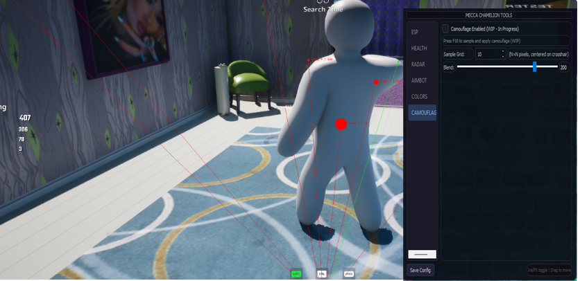

<div align="center">
  


# Meccha Chameleon Tools

External ESP - Aimbot - Radar for MECCA CHAMELEON (UE5)


https://github.com/user-attachments/assets/08420e1f-2f3c-41e6-b520-1348202c070d
</div>

---

## Features

| Category | Capabilities |
|----------|-------------|
| **ESP** | Dot / 2D Box / Skeleton overlay, names, distance, snap lines, team filter, distance scaling |
| **Health Bars** | Health bar and shield bar, adjustable model height and Y offset |
| **Radar** | External minimap radar with configurable size and range |
| **Aimbot** | Smooth aim assist, FOV circle, rebindable key |
| **Camouflage** | Bundled paint EXE, F10 start / F9 stop, debounce-protected triggers, fast paint tuning |

All ESP features are fully external (memory read). Camouflage uses a bundled bridge EXE that is auto-launched and auto-triggered.

---

## Quick Start

### Option 1 - Standalone (no Python required)

1. Download the latest release EXE
2. Launch MECCA CHAMELEON (windowed / borderless)
3. Run the EXE

### Option 2 - From source

```
pip install -r requirements.txt
python -m meccha_chameleon_tools
```

Requirements: Windows 10/11, game running in windowed/borderless mode.

---

## Controls

| Key | Action |
|-----|--------|
| Insert / F1 | Toggle settings menu |
| F10 | Camouflage paint **start** (when enabled in Camouflage tab) |
| F9 | Camouflage paint **stop / cancel** (cancels active paint via bridge) |
| Close button | Bottom bar of menu -- quits the application entirely |

### Settings Tabs

The menu organises options across five tabs selected from a sidebar:

**ESP** - Enable/disable, style toggles (Dot / 2D Box / Skeleton), Show Local Player, Names, Distance, Snap Lines, Team Filter, Distance Scaling, dot radius.

**HEALTH** - Health bar toggle, shield bar toggle, model height, Y offset.

**RADAR** - Enable/disable, radar size (80-400 px), radar range (1000-50000).

**AIMBOT** - Enable toggle, FOV circle display (only shown when targets exist), key binding recorder, FOV radius, smoothing factor, aim offset.

**Camouflage** - Enable/disable camouflage painting. Press **F10** in-game to start painting, **F9** to cancel an active paint. The tool auto-launches the bundled bridge EXE and triggers F10 for you.

---

## Package

```
meccha_chameleon_tools/   # Python package
|-- __init__.py           # Main application entry point
|-- __main__.py           # Module runner
|-- config.py             # Configuration + JSON save/load
|-- core.py               # Memory reading, ESP logic
|-- ui.py                 # Qt5 overlay + menu GUI
```

---

## Camouflage Standalone Files

The camouflage feature is built from three standalone files. These are bundled into the main `MecchaCamouflage.exe` release (auto-extracted to `%APPDATA%\MecchaCamouflage\`), but are also published as a single **`camouflage-standalone.zip`** for manual use or integration with other loaders.

| File | Description |
|------|-------------|
| `meccha-camouflage.exe` | Camouflage paint bridge — connects to the running game and executes the native template brush paint route. |
| `meccha-xenos-bridge.dll` | Xenos bridge DLL — injected into the game process to broker native calls between the bridge EXE and the engine. |
| `meccha-xenos-injector.exe` | Xenos loader — launches and injects `meccha-xenos-bridge.dll` into the target process. |

### Manual Usage

1. Download and extract `camouflage-standalone.zip`.
2. Launch MECCA CHAMELEON.
3. Run `meccha-xenos-injector.exe` (injects `meccha-xenos-bridge.dll`).
4. Run `meccha-camouflage.exe` (starts the bridge).
5. Press **F10** in-game to start painting / **F9** to cancel.

The ZIP is attached to every `v1.7.x` release as a standalone asset.

## Architecture

```
PatternScanner -> GUObjectArray, FNamePool
UObjectArray -> find_class, iter_objects
OffsetResolver -> dynamic property walking
GameReader -> world, camera, players
Overlay -> QPainter rendering loop @ 60 fps
Menu -> PyQt5 settings window (5-tab sidebar: ESP, HEALTH, RADAR, AIMBOT, Camouflage)
```

### Memory Access

1. **Pattern scanning** locates GUObjectArray and FNamePool in the game module via signature matching with fallback chains.
2. **Object walking** enumerates all UObjects to resolve engine class addresses and find player pawns, controllers, and camera managers.
3. **Dynamic offset resolution** walks the UStruct::ChildProperties -> FField::Next chain to find property offsets at runtime - no hardcoded offsets.
4. **ESP** reads player positions from GameState -> PlayerArray -> PlayerState -> PawnPrivate -> RootComponent -> RelativeLocation, projects through the camera view matrix.
5. **Radar** projects player positions relative to local player orientation onto a 2D minimap display.
6. **Aimbot** reads/writes ControlRotation on the local player controller with configurable smoothing.

### Engine Compatibility

The FNameResolver auto-detects UE4, UE5, and custom header-layout variants. The PatternScanner uses chunked reads (2 MiB) to avoid large allocations on shipping executables.

---

## Troubleshooting

| Symptom | Likely Cause | Fix |
|---------|-------------|-----|
| Game attach failed | Process name mismatch | Verify PenguinHotel-Win64-Shipping.exe is running |
| ESP shows nothing | Not in a match with players | Load into a lobby or match |
| Only 1-2 players detected (4+ in game) | Team filter on; all use same character class | Disable Team Filter in the ESP tab |
| Snap lines not visible | w2s dropped off-screen projections | Update — off-screen players now correctly draw lines to screen edge |
| Aimbot not firing | Key binding mismatch | Re-record the aim key in the AIMBOT tab |
| Radar not showing | Radar disabled | Enable Radar Enabled in the RADAR tab |

---

## Changelog

### v1.7.4 - F9 stop hotkey + F10 debounce fix

- **F9 stop** — new hotkey cancels an active camouflage paint via the bridge `cancel_paint` command. Overlay shows "CAMO STOPPED (F9)" feedback.
- **F10 debounce fix** — F10 and F9 now require the key to be held for ≥2 consecutive polls (100 ms) AND released for ≥2 polls before re-arming. Eliminates phantom `GetAsyncKeyState` reads that caused F10 to auto-trigger repeatedly.
- Stop wiring reuses the existing `camo_stop()` bridge command in core.py.

### v1.7.0 - Reworked camouflage + UI cleanup

- **Reworked camouflage EXE** bundled directly into the release (no separate download).
- **Removed COLORS tab** from the menu.
- **Renamed CAMO tab** to **Camouflage**.
- **F10 hotkey** for camouflage (replaces F9).
- **Auto F10 trigger** — the tool automatically sends F10 to start the bridge, no manual keypress needed.
- **Speed-tuned paint** — 256 paints/tick, brush_radius 4.0, 5000 min points, auto-flush enabled.
- **Stable extraction path** — EXE and DLL extract to `%APPDATA%\MecchaCamouflage\` on first run.
- **Aimbot FOV circle** now only draws when valid targets exist on screen.

### v1.6.0 - Bundled camouflage EXE with auto F10

- First release to bundle `meccha-camouflage.exe` and bridge DLL into the PyInstaller build.
- Stable `%APPDATA%` extraction path, auto F10 trigger, fast paint tuning, cleanup on exit.

### v1.5.3 - CAMO tab, UI improvements

- **CAMOUFLAGE tab** with enable toggle, color picker, sample grid size, blend opacity, and Paint Now button.
- **UI credit** -- improvements by @mhmmmm000000 (PR #4).
- **F9 hotkey** now gated by the CAMO tab toggle.
- New config fields: `camouflage_enabled`, `camouflage_sample_size`, `camouflage_opacity`.

### v1.5.0 - Clean startup, aimbot consistency fix

- **Removed all startup dialogs** -- no game directory prompt, no GitHub download check, no camouflage opt-in dialog. Tool launches silently.
- **Aimbot consistency fix** -- `_aim_at()` now uses the same camera data as `_find_best_target()` instead of re-fetching, eliminating aim drift.

### v1.4.1 - CI auto-build + Close button + __main__ fix

- **CI/CD** -- GitHub Actions auto-builds the single-file EXE on every push to master and attaches it to releases.
- **Close button** -- added to the menu bottom bar to quit the application at any time.
- **__main__.py fix** -- corrected import path (double-__init__) to prevent EXE crash when game is not running.

### v1.4.0 - Smarter auto-install (prompt only on first launch) + CI auto-build

- **CI/CD** -- GitHub Actions auto-builds the EXE on every push to master and attaches it to published releases.
- **Prompt only once** -- dialog only shows if no release is found in the game directory.
- **Already installed** -- no dialog at all, no GitHub API call, opens menu directly.
- **First install** -- checks GitHub and asks "Install MecchaCamouflage?" with version info.
- **Version tracking** -- .meccha_version file written to game directory after install.

### v1.3.0 - Camouflage optional (DEV) + auto-install prompt

- **Camouflage is now disabled by default** -- user is asked at startup whether to enable it.
- **Auto-install prompt** -- tool asks at startup whether to download the latest release from GitHub to the game directory.

### v1.2.1 - Player count & snap line fixes

- **Fix: Only 1-2 players detected** - Team filter default changed to False.
- **Fix: Snap lines not drawing** - w2s() no longer returns None for off-screen positions.

### v1.2.0 - Tabbed UI

- Sidebar with five tabs: ESP, HEALTH, RADAR, AIMBOT, COLORS
- All toggles, sliders, and color pickers organised per-tab
- Rebindable aim key with Insert/F1 menu toggle
- First standalone release with PyInstaller build

### v1.1.x - Initial releases

---

## Disclaimer

Educational and research purposes only. Use at your own risk.
